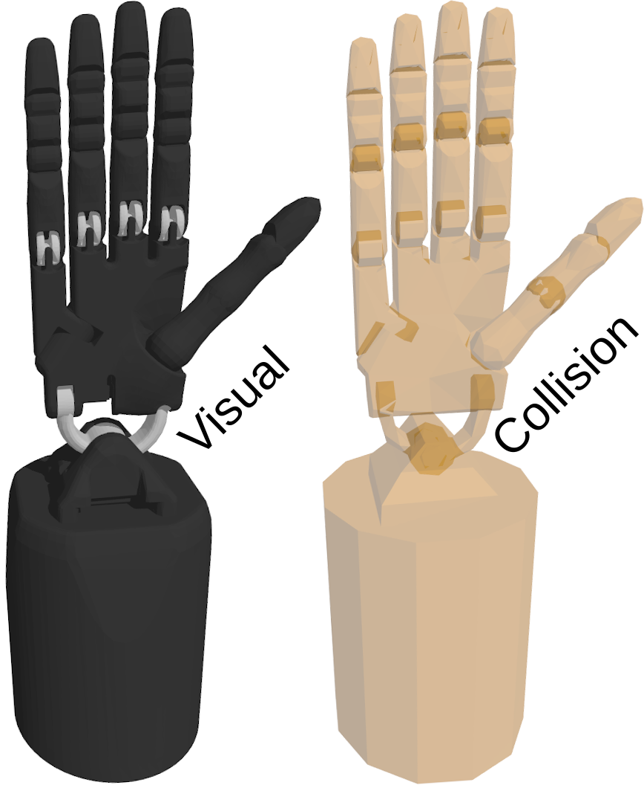

# shadow_hand_ign

URDF and SDF descriptions of Shadow Hand compatible with Ignition.



Visual mesh geometry and kinematic properties are taken from [shadow-robot/sr_common](https://github.com/shadow-robot/sr_common). Collision geometry was remodelled to improve physical interactions (at the cost of performance). 

Inertial properties of all links are estimated with [estimate_inertial_properties.py](scripts/estimate_inertial_properties.py) script, while assuming total mass of 4.2 kg and uniform density. Furthermore, 50% of forearm's mass is redistributed to other links in order to account for the mechanical coupling via tendons.

> Names of links and joints were changed to simplify the model and they do not match the original URDF description.

## Instructions

### ROS 2 (Optional)

Build with `colcon` and source the environment to make URDF discoverable for ROS 2.

### Ignition

Export `IGN_GAZEBO_RESOURCE_PATH` to make SDF discoverable within the context of Ignition Gazebo.

```bash
export IGN_GAZEBO_RESOURCE_PATH=${PARENT_DIR}/shadow_hand_ign:${IGN_GAZEBO_RESOURCE_PATH}
```

Alternatively, you can just include the model from [Ignition Fuel](https://app.ignitionrobotics.org/AndrejOrsula/fuel/models/shadow_hand) if you do not require the URDF description (or you use it from the official [franka_description](https://github.com/frankaemika/franka_ros)).

```xml
<include>
    <uri>https://fuel.ignitionrobotics.org/1.0/AndrejOrsula/models/shadow_hand</uri>
</include>
```

## Directory Structure

```bash
shadow_hand_ign
├── shadow_hand          # Model directory compatible with Ignition Fuel
    ├─ meshes            # Meshes for both SDF and URDF
        ├── collision    # STL files for collision detection
            └─ *.stl
        └── visual       # COLLADA files for visuals
            └─ *.dae
    ├─ thumbnails        # Thumbnails for Fuel
        └─ *.png
    ├── model.config     # Ignition model meta data
    └── model.sdf        # SDF description of the Ignition model
├── urdf
    └── shadow_hand.urdf # URDF description of the model for MoveIt2
├── CMakeLists.txt
└── package.xml          # ROS2 shadow_hand description package `shadow_hand_ign`
```
